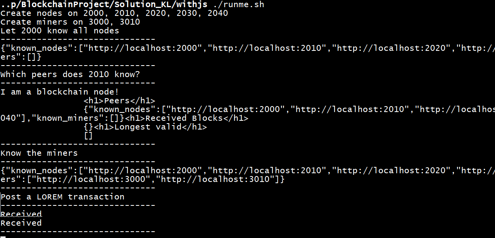
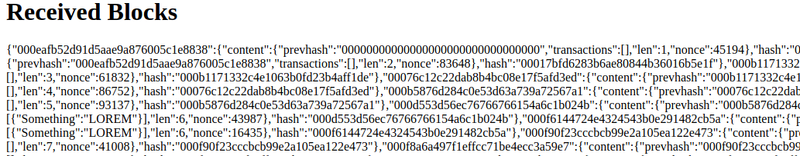

# API

Node

| Endpoint | Purpose |
| --- | --- |
| GET / | View received blocks and known peers in browser |
| POST /discover | Send list of known peers to discover. Ignore already known |
| POST /block | Receive a block and consider it for longest chain |

In any case, a node will upon `POST /block` respond with the block of the longest chain.
Bastard miners can ignore it but the legitimate miners should agree upon it.

Miner

| Endpoint | Purpose |
| --- | --- |
| GET / | View current commit set and known peers in browser |
| POST /discover | Send list of known peers to discover. Ignore already known |
| POST /transaction | Receive a new transaction to add to commit set |
| POST /block | Receive a block to use as newest and discard current commit set |

# Test



The scenario `runme.sh` creates nodes on `localhost:2000`, `localhost:2010`,
`localhost:2020`, `localhost:2030`, `localhost:2040`.
It then lets them know eachother with a `POST` request to `/discover`
to `localhost:2010`, which then forwards the discovery request to all
known peers. All peers will keep forwarding that to all known peers
until there is nothing new to add.

It also creates miners on `localhost:3000` and `localhost:3010`
The miners are discovered by sending a single `POST` request to `/discover`
as well. The miners start mining empty blocks.
The scenario then tries to insert a transaction with the contents

```json
{"Something": "LOREM"}
```

by sending that transaction to each miner. In this test run, both
miners managed to mine a valid block which got forwarded to the nodes.
It can be seen that both potentially valid blocks were received.



That is a conflict and is resolved by the next block. Which one
will it attach to? That determines the longest chain.


```json
[
    {
        "content": {
            "prevhash": "000398f12bf13897f7264442ddfc242e",
            "transactions": [],
            "len": 11,
            "nonce": 1177
        },
        "hash": "00079514be8d27682b1a4db4c2551eff"
    },
    {
        "content": {
            "prevhash": "0008044e54eec83ce95d194472b46a23",
            "transactions": [],
            "len": 10,
            "nonce": 40764
        },
        "hash": "000398f12bf13897f7264442ddfc242e"
    },
    {
        "content": {
            "prevhash": "000f8a6a497f1effcc71be4ecc3a59e7",
            "transactions": [],
            "len": 9,
            "nonce": 36249
        },
        "hash": "0008044e54eec83ce95d194472b46a23"
    },
    {
        "content": {
            "prevhash": "000f90f23cccbcb99e2a105ea122e473",
            "transactions": [],
            "len": 8,
            "nonce": 40131
        },
        "hash": "000f8a6a497f1effcc71be4ecc3a59e7"
    },
    {
        "content": {
            "prevhash": "000f6144724e4324543b0e291482cb5a",
            "transactions": [],
            "len": 7,
            "nonce": 41008
        },
        "hash": "000f90f23cccbcb99e2a105ea122e473"
    },
    {
        "content": {
            "prevhash": "000b5876d284c0e53d63a739a72567a1",
            "transactions": [
                {
                    "Something": "LOREM"
                }
            ],
            "len": 6,
            "nonce": 16435
        },
        "hash": "000f6144724e4324543b0e291482cb5a"
    },
    {
        "content": {
            "prevhash": "00076c12c22dab8b4bc08e17f5afd3ed",
            "transactions": [],
            "len": 5,
            "nonce": 93137
        },
        "hash": "000b5876d284c0e53d63a739a72567a1"
    },
    {
        "content": {
            "prevhash": "000b1171332c4e1063b0fd23b4aff1de",
            "transactions": [],
            "len": 4,
            "nonce": 86752
        },
        "hash": "00076c12c22dab8b4bc08e17f5afd3ed"
    },
    {
        "content": {
            "prevhash": "00017bfd6283b6ae80844b36016b5e1f",
            "transactions": [],
            "len": 3,
            "nonce": 61832
        },
        "hash": "000b1171332c4e1063b0fd23b4aff1de"
    },
    {
        "content": {
            "prevhash": "000eafb52d91d5aae9a876005c1e8838",
            "transactions": [],
            "len": 2,
            "nonce": 83648
        },
        "hash": "00017bfd6283b6ae80844b36016b5e1f"
    },
    {
        "content": {
            "prevhash": "00000000000000000000000000000000",
            "transactions": [],
            "len": 1,
            "nonce": 45194
        },
        "hash": "000eafb52d91d5aae9a876005c1e8838"
    }
]
```


# Sources
- https://en.wikipedia.org/wiki/Blockchain
- https://expressjs.com/en/starter/hello-world.html
